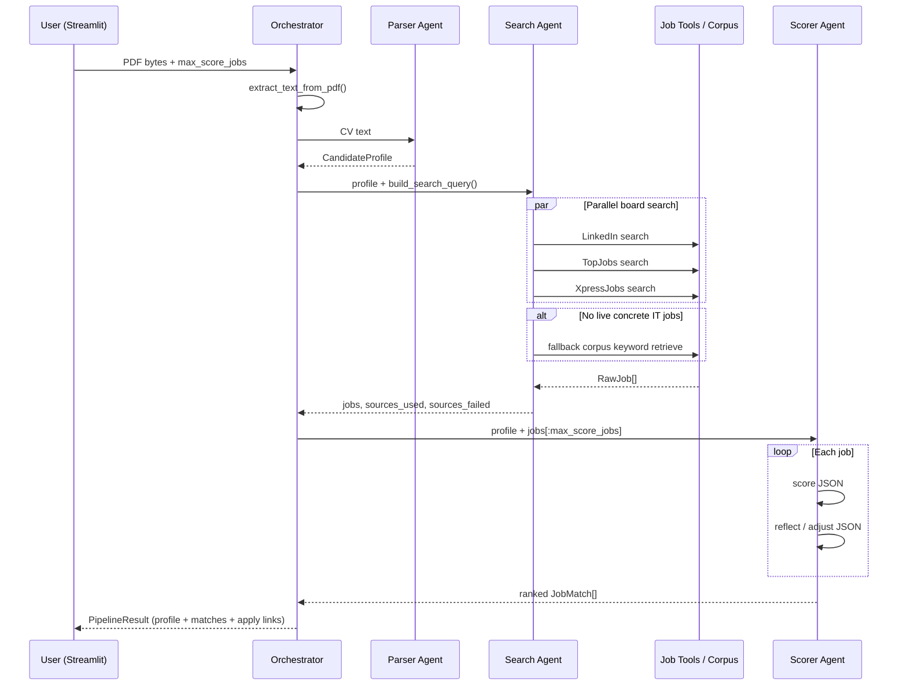

# Job Matching Multi-Agent App

**Live demo:** [https://jobfinderr.streamlit.app/](https://jobfinderr.streamlit.app/)  
**Repository:** [https://github.com/kavi35/jobfinder](https://github.com/kavi35/jobfinder)  
**Demo video:** [https://youtu.be/Mt5jAaLfqaI](https://youtu.be/Mt5jAaLfqaI)

---

## Project Description

### Problem statement
Job seekers in Sri Lanka often juggle multiple boards (LinkedIn, TopJobs.lk, XpressJobs), manually compare each posting to their CV, and still miss skill gaps. That process is slow, inconsistent, and easy to bias toward the wrong domain (for example, IT roles for a teaching CV).

### Purpose of the project
This app automates CV → job matching with a multi-agent pipeline: parse the CV into a structured profile, search multiple job sources in parallel, retrieve offline corpus jobs when live boards fail, score fit with an LLM, and surface ranked apply links in a Streamlit UI.

### Key features
- PDF CV upload and text extraction
- **PDF Parser Agent** — structured candidate profile (skills, roles, experience)
- **Search Agent** — parallel search across LinkedIn, TopJobs.lk, and XpressJobs
- Domain-aware filtering (education / marketing / IT / etc.) so results stay on-topic
- Offline **jobs corpus fallback** when live boards return no concrete listings
- **Scorer Agent** — match score, matched/missing skills, actionable feedback (with reflection pass)
- Ranked results with source badges and direct **Apply / Open listing** links
- Configurable “Jobs to score” limit for latency and API cost control

---

## Architecture Diagram

### Overall system architecture

```text
┌─────────────────────────────────────────────────────────────────┐
│                     Streamlit UI (app.py)                        │
│         Upload CV · Show profile · Ranked matches · Apply        │
└────────────────────────────┬────────────────────────────────────┘
                             │ run_pipeline(pdf_bytes)
                             ▼
┌─────────────────────────────────────────────────────────────────┐
│              Orchestrator (src/workflows.py)                     │
└──────┬──────────────┬──────────────────────────┬────────────────┘
       │              │                          │
       ▼              ▼                          ▼
┌─────────────┐ ┌──────────────┐        ┌─────────────────┐
│ PDF Parser  │ │ Search Agent │        │  Scorer Agent   │
│ Agent       │ │              │        │                 │
│ DeepSeek    │ │ Parallel     │        │ DeepSeek /      │
│             │ │ tool calls   │        │ OpenRouter +    │
└──────┬──────┘ └──────┬───────┘        │ reflection      │
       │               │                └────────┬────────┘
       │               ▼                         │
       │    ┌──────────────────────────┐         │
       │    │ LinkedIn · TopJobs ·     │         │
       │    │ XpressJobs · Fallback    │         │
       │    │ corpus (keyword RAG)     │         │
       │    └──────────────────────────┘         │
       │               │                         │
       └───────────────┴──────────► ranked JobMatch list
```

### Components and how they interact

| Component | Role | Interaction |
|-----------|------|-------------|
| `app.py` | Frontend | Calls `run_pipeline`, renders profile + matches |
| `src/workflows.py` | Orchestrator | Sequences parse → search → score |
| `parser_agent.py` | Profile extraction | CV text → `CandidateProfile` |
| `search_agent.py` | Job discovery | Profile/query → tools → `RawJob[]` |
| Job tools | External I/O | LinkedIn deep-links; TopJobs/XpressJobs HTTP scrape; local corpus |
| `scorer_agent.py` | Fit evaluation | Profile + `RawJob` → scored `JobMatch` (score + reflect) |
| `models.py` | Model router | Chooses DeepSeek (fast/reasoner) or OpenRouter fallback |
| `schemas.py` | Shared contracts | Pydantic message/data models between agents |

---

## Technology Stack

| Layer | Technology |
|-------|------------|
| **Frontend** | Streamlit |
| **Backend** | Python 3 orchestration (`src/workflows.py`), HTTP tools (`httpx`, BeautifulSoup) |
| **AI Frameworks** | LangChain (`langchain-openai` / `ChatOpenAI`), Pydantic schemas |
| **Database** | None (stateless request pipeline; no persistent app DB) |
| **Vector Database** | Not used — offline retrieval is **lexical/keyword** over `data/jobs_corpus/` (in-process ranking) |
| **Deployment Platform** | [Streamlit Community Cloud](https://jobfinderr.streamlit.app/) |
| **LLM providers** | DeepSeek (primary), OpenRouter (optional scoring fallback) |
| **PDF** | `pypdf` |

---

## Agentic AI Design Patterns

### Pattern 1 — Sequential pipeline orchestration
Agents run in a fixed order: extract PDF → parse profile → search jobs → score matches.

**Where implemented:** `src/workflows.py` → `run_pipeline()`

### Pattern 2 — Parallel tool-using agent
The Search Agent fans out to LinkedIn, TopJobs, and XpressJobs concurrently, then merges, domain-filters, and deduplicates results. If live boards lack concrete listings (IT profiles), it falls back to the local corpus.

**Where implemented:** `src/agents/search_agent.py` → `find_jobs()` with `ThreadPoolExecutor`; tools under `src/tools/`

### Pattern 3 — Reflection / self-critique
The Scorer Agent first produces a fit score, then runs a second LLM pass that reviews whether the score overstates fit given missing skills and can lower the score.

**Where implemented:** `src/agents/scorer_agent.py` → `score_job()` (`SCORE_PROMPT` then `REFLECT_PROMPT`)

**Bonus routing pattern:** `src/utils/models.py` routes **fast** LLM (`get_fast_llm`) for parsing and **reasoner** LLM (`get_reasoner_llm`) for scoring, with DeepSeek preferred and OpenRouter as fallback.

---

## Agent-to-Agent Communication

### Explain each agent

1. **PDF Parser Agent** (`src/agents/parser_agent.py`)  
   Input: raw CV text. Output: `CandidateProfile` (name, skills, experience, education, preferred roles). Uses DeepSeek; falls back to heuristics if the LLM is unavailable.

2. **Search Agent** (`src/agents/search_agent.py`)  
   Input: `CandidateProfile` (+ built query). Output: list of `RawJob`, plus `sources_used` / `sources_failed`. Talks to job-board tools and optional corpus retrieval.

3. **Scorer Agent** (`src/agents/scorer_agent.py`)  
   Input: `CandidateProfile` + `RawJob[]`. Output: ranked `JobMatch[]` with `match_score`, matched/missing skills, and feedback.

### Message format
Agents exchange **typed Pydantic models** (not free-form chat strings between agents):

```python
# CandidateProfile — parser → search / scorer
{ "name", "skills[]", "experience_years", "experience_summary", "education", "preferred_roles[]" }

# RawJob — search → scorer
{ "title", "company", "location", "description", "source", "apply_url", "job_id" }

# JobMatch — scorer → UI
{ ...RawJob fields..., "match_score", "matched_skills[]", "missing_skills[]", "feedback" }

# PipelineResult — orchestrator → Streamlit
{ "profile", "matches[]", "search_query", "sources_used[]", "sources_failed[]" }
```

Defined in `src/utils/schemas.py`.

### Sequence / Message Flow Diagram



---

## Model Selection Strategy

| Sub-task | Model | Provider | Why Chosen | Latency | Cost | Context Window | Reasoning Quality |
|----------|-------|----------|------------|---------|------|----------------|-------------------|
| CV parsing (structured JSON) | `deepseek-chat` | DeepSeek | Fast, low cost, strong instruction following for extraction | Low | Low | Large (API-managed; CV truncated to ~12k chars in prompt) | Good for extraction |
| Job-fit scoring + reflection | `deepseek-chat` | DeepSeek (primary) | Same key path as parser; adequate reasoning for honest fit scores | Medium (2 calls/job) | Low–Medium | Large | Good |
| Job-fit scoring fallback | `openai/gpt-4o-mini` | OpenRouter | Available if DeepSeek key missing; solid JSON scoring | Low–Medium | Low | ~128k | Good |
| Heuristic parse/score (no API) | Rule-based | Local | Resilience when keys/network fail | Very low | Free | N/A | Limited |
| Embedding / vector search | — | — | Not required; corpus uses keyword overlap retrieval | — | — | — | — |

Model wiring lives in `src/utils/models.py` (`get_fast_llm`, `get_reasoner_llm`).

---

## RAG Pipeline

Offline retrieval supports the Search Agent when live boards do not return usable listings (IT profiles).

| Aspect | Detail |
|--------|--------|
| **Data source** | `data/jobs_corpus/*.txt` — sample Sri Lankan / IT-oriented job postings |
| **Number of documents** | **20** job text files (`job_01` … `job_20`) |
| **Chunking strategy** | **Document-level** — each file is one chunk (title/company/location header + full responsibilities/requirements). No sliding-window split |
| **Embedding model** | **None** — sparse/lexical retrieval (query token overlap), not dense embeddings |
| **Vector database** | **None** — in-process scan + score in `src/tools/fallback_corpus.py` |
| **Retrieval workflow** | 1) Tokenize search query 2) Score each corpus file by token hits 3) Sort descending 4) Return top-N as `RawJob` with `source="fallback"` 5) Scorer Agent uses retrieved text as context for fit evaluation |

This is a **lightweight lexical RAG / corpus-fallback** path rather than a Chroma/FAISS embedding stack.

---

## Retrieval Evaluation

Evaluated against the local corpus (`data/jobs_corpus/`) using representative queries (keyword retrieval).

| Query | Retrieved Context Relevant? | Comments |
|-------|-----------------------------|----------|
| `Junior Software Engineer Python FastAPI` | Yes | Surfaces junior SE / Python-oriented docs (e.g. `job_01_junior_se.txt`, Python-related roles) |
| `DevOps Docker Kubernetes` | Yes | Prefers DevOps / cloud-ops style corpus entries over unrelated teacher/sales-like titles |
| `Data Analyst SQL Excel` | Yes | Retrieves data/analytics-oriented postings from the corpus |
| `UI UX Designer Figma` | Yes | Matches design-focused corpus jobs rather than backend-only listings |
| `Mathematics Teacher classroom pedagogy` | No* | Corpus is IT-oriented; Search Agent also **disables** corpus fallback for non-tech domains, so teaching CVs rely on live TopJobs/XpressJobs/LinkedIn instead |

\*By design: avoiding irrelevant IT corpus hits for non-IT candidates improves end-to-end relevance even when lexical corpus match would be weak.

---

## Installation

### Clone repository

```bash
git clone https://github.com/kavi35/jobfinder.git
cd jobfinder
```

### Install dependencies

```powershell
python -m venv .venv
.\.venv\Scripts\Activate.ps1
pip install -r requirements.txt
```

### Configure environment variables

Create `.streamlit/secrets.toml` (preferred for Streamlit) or set env vars:

```toml
DEEPSEEK_API_KEY = "sk-..."
OPENROUTER_API_KEY = "sk-or-..."
```

Get a DeepSeek key from [platform.deepseek.com](https://platform.deepseek.com).  
OpenRouter is optional (scoring fallback).

### Run locally

```powershell
streamlit run app.py
```

Then open the local URL shown in the terminal (typically `http://localhost:8501`).

---

## Project Structure

```text
job/
├── app.py                      # Streamlit UI
├── requirements.txt
├── README.md
├── .gitignore
├── data/
│   └── jobs_corpus/            # Offline RAG / fallback documents (20)
├── src/
│   ├── workflows.py            # Multi-agent orchestration
│   ├── agents/
│   │   ├── parser_agent.py     # PDF Parser Agent
│   │   ├── search_agent.py     # Search Agent
│   │   └── scorer_agent.py     # Scorer Agent (+ reflection)
│   ├── tools/
│   │   ├── linkedin_jobs.py
│   │   ├── topjobs.py
│   │   ├── xpressjobs.py
│   │   ├── fallback_corpus.py  # Lexical corpus retrieval
│   │   └── http_utils.py
│   └── utils/
│       ├── models.py           # LLM model router
│       ├── schemas.py          # Agent message contracts
│       ├── pdf_parser.py
│       └── domain.py           # Domain detection / TopJobs FA codes
```

*(Assignment template folders such as `rag/` / `models/` are mapped onto `src/tools/fallback_corpus.py` + `data/jobs_corpus/` and `src/utils/models.py` respectively.)*

---

## Environment Variables

```env
DEEPSEEK_API_KEY=
OPENROUTER_API_KEY=
GROQ_API_KEY=
```

| Variable | Required? | Usage in this project |
|----------|-----------|------------------------|
| `DEEPSEEK_API_KEY` | **Yes** (recommended) | CV parsing + primary scoring via DeepSeek API |
| `OPENROUTER_API_KEY` | Optional | Scoring fallback (`openai/gpt-4o-mini`) if DeepSeek is unset |
| `GROQ_API_KEY` | Optional / unused | Reserved for assignment compatibility; app currently routes via DeepSeek/OpenRouter |

Keys may be set as environment variables or in `.streamlit/secrets.toml`.

---

## Streamlit Deployment

- **Live Demo Link:** [https://jobfinderr.streamlit.app/](https://jobfinderr.streamlit.app/)
- Deployed from GitHub repo [kavi35/jobfinder](https://github.com/kavi35/jobfinder) on Streamlit Community Cloud
- Configure the same secrets (`DEEPSEEK_API_KEY`, optionally `OPENROUTER_API_KEY`) in the Streamlit Cloud app settings

---

## Git Branch Strategy

Feature branches used / planned for incremental delivery:

| Branch | Focus |
|--------|--------|
| `feature/rag-pipeline` | Jobs corpus + fallback retrieval (`data/jobs_corpus`, `fallback_corpus.py`) |
| `feature/model-router` | DeepSeek / OpenRouter selection (`src/utils/models.py`) |
| `feature/agent-orchestration` | Parser / Search / Scorer agents + `workflows.py` |
| `feature/streamlit-ui` | Streamlit upload UI and ranked apply links (`app.py`) |
| `feature/job-tools` | Live board connectors (LinkedIn / TopJobs / XpressJobs) |

`main` holds the integrable, deployable application.

---

## Known Limitations

### Current limitations
- LinkedIn does not allow reliable scraping; LinkedIn results are **public search deep-links**, not scraped listing HTML
- TopJobs / XpressJobs HTML structure can change and break parsers; pipeline continues with remaining sources
- Offline corpus is small (**20** docs) and **IT-biased**; non-IT domains intentionally skip corpus fallback
- No dense embeddings or vector DB — retrieval is keyword overlap only
- Scoring cost/latency grows with “Jobs to score” (reflection = extra LLM call per job)
- Scanned/image-only PDFs are not OCR’d (`pypdf` text extraction only)
- No persistent user accounts, history, or application tracking DB

### Future improvements
- Add embeddings + Chroma/FAISS for semantic corpus retrieval
- Expand multi-domain corpus (teaching, marketing, finance, etc.)
- Optional Groq route for ultra-low-latency parsing
- Caching of board results and scored matches
- OCR support for scanned CVs
- Unit/integration tests for agents and retrieval evaluation harness

---

## References

- [Streamlit documentation](https://docs.streamlit.com/)
- [LangChain ChatOpenAI](https://python.langchain.com/docs/integrations/chat/openai/)
- [DeepSeek API](https://platform.deepseek.com/)
- [OpenRouter](https://openrouter.ai/)
- [TopJobs.lk](https://www.topjobs.lk/)
- [XpressJobs](https://www.xpress.jobs/)
- [LinkedIn Jobs](https://www.linkedin.com/jobs/)
- [Pydantic](https://docs.pydantic.dev/)
- [pypdf](https://pypdf.readthedocs.io/)

---

## Acknowledgements

### Libraries used
- Streamlit, LangChain, langchain-openai, Pydantic, pypdf, BeautifulSoup4, httpx, lxml, python-dotenv

### AI tools used
- DeepSeek Chat (primary LLM)
- OpenRouter / GPT-4o-mini (optional fallback)


---

## Demo Video

- **2-minute screen recording:** [https://youtu.be/Mt5jAaLfqaI](https://youtu.be/Mt5jAaLfqaI)
